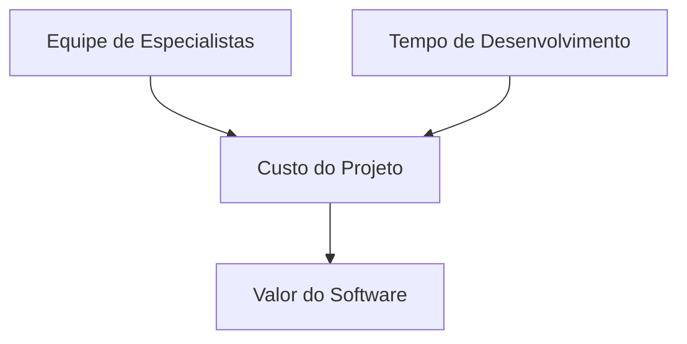
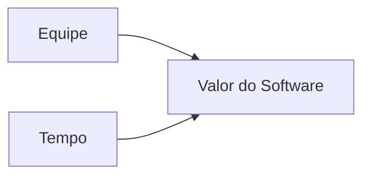
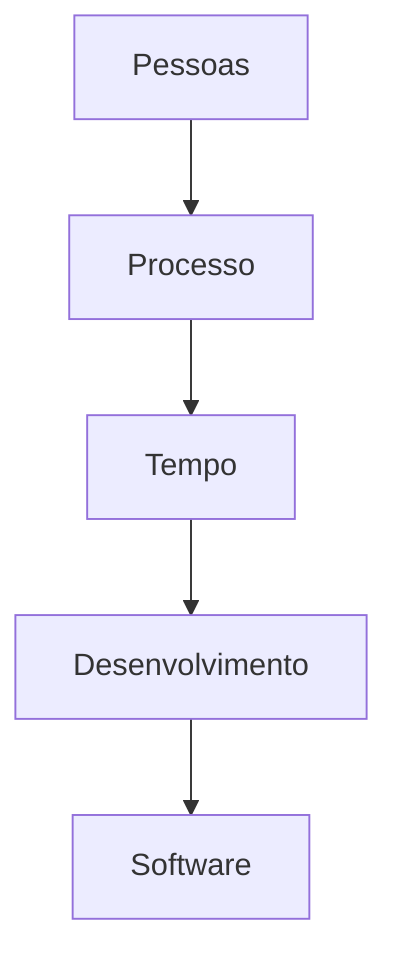

# Precificação de Desenvolvimento de Software

Este documento explica de forma simples como o valor de um software é definido.  
O objetivo é demonstrar que o preço de um sistema é resultado da combinação entre **pessoas, tempo e processo de desenvolvimento**.

---

# 1. Como uma ideia vira software

Para transformar uma necessidade do cliente em um sistema funcional, existe um fluxo de trabalho envolvendo diferentes profissionais.

```mermaid
flowchart TD

A[Ideia do Cliente] --> B[Product Owner<br>Define funcionalidades]

B --> C[Scrum Master<br>Organiza o processo]

C --> D[Time de Desenvolvimento]

D --> E[Backend Developer]
D --> F[Frontend Developer]
D --> G[UI Designer]

E --> H[Líder Técnico]
F --> H
G --> H

H --> I[Software Final]
````

---

# 2. Ciclo de desenvolvimento (Sprint)

O desenvolvimento acontece em ciclos curtos chamados **Sprints**, normalmente com duração de **2 semanas**.

```mermaid
flowchart LR

A[Planejamento] --> B[Desenvolvimento]
B --> C[Testes]
C --> D[Entrega]
D --> E[Feedback]
E --> A
```

Em média:

* **1 Sprint = 2 semanas**
* **1 mês ≈ 2 Sprints**

---

# 3. Estrutura da equipe

Uma equipe típica de desenvolvimento pode ser composta pelos seguintes profissionais:

| Profissional       | Responsabilidade       |
| ------------------ | ---------------------- |
| Product Owner      | define funcionalidades |
| Scrum Master       | organiza o processo    |
| Líder Técnico      | define arquitetura     |
| Backend Developer  | regras de negócio      |
| Frontend Developer | interface do sistema   |
| UI Designer        | experiência do usuário |

---

# 4. Exemplo de custo mensal da equipe

Valores médios de mercado (exemplo):

| Profissional       | Média mensal |
| ------------------ | ------------ |
| Product Owner      | R$ 12.000    |
| Scrum Master       | R$ 10.000    |
| Líder Técnico      | R$ 18.000    |
| Backend Developer  | R$ 12.000    |
| Frontend Developer | R$ 10.000    |
| UI Designer        | R$ 8.000     |

**Custo aproximado da equipe por mês**

```
≈ R$ 70.000 / mês
```

---

# 5. Como o valor do software é definido

O preço de um software depende principalmente de dois fatores:

* tamanho da equipe
* tempo de desenvolvimento



---

# 6. Exemplo de cálculo

```text
Custo mensal da equipe = 70k

Tempo estimado do projeto = 4 meses

70k × 4

≈ R$ 280.000
```

---

# 7. Modelo simplificado de entendimento

Uma forma simples de entender o valor de um software:



---

# 8. Conceito principal

Software não é um produto pronto de prateleira.

Ele é resultado de:



---

# Conclusão

O investimento em software está diretamente relacionado a:

* complexidade do sistema
* tamanho da equipe necessária
* tempo de desenvolvimento
* qualidade e arquitetura desejadas

**Fórmula simplificada**

```
Equipe × Tempo = Valor do Software
```

